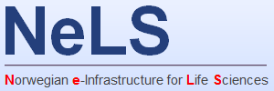

# What is NeLS
NeLS is short for Norwegian e-Infrastructure for Life Sciences. [NeLS](https://nels.bioinfo.no/) is a national portal for sharing, analysis and mid-term storage of non-sensitive molecular life science data developed and operated by [ELIXIR Norway](https://elixir.no/).

## Who can use NeLS?

We currently offer free storage of data up to 10TB. For larger projects, please contact us at [contact@bioinfo.no](mailto:contact@bioinfo.no).

All research projects with a Norwegian partner with funding from national funding bodies (NFR, Universities, Helseforetak, etc) and EU grants are entitled to store life science data in NeLS. This also includes private companies and governmental research institutions.

Research projects (with a Norwegian partner) that do not fall into the definition above can still apply for a storage quota, but these projects will be treated according to the user contribution model for granting storage to projects by Sigma2.

If you data is generated at one of the Norwegian sequencing core facilities organized in NorSeq, your core facility can help you with the application and directly upload the data to NeLS for you.

The storage quota provided are available in the NeLS infrastructure for non-sensitive data and in TSD for sensitive data. This service is operated in collaboration with Sigma2, through the national storage infrastructure NIRD.

!!! note

     To access the NeLS portal, see [this documentation](./How_to_obtain_access_to_NeLS.md)