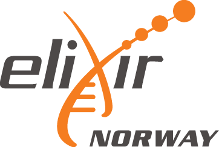
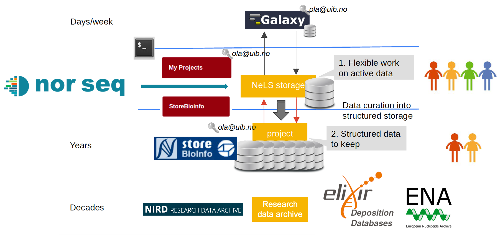

# About ELIXIR Norway and NeLS



## What is ELIXIR Norway
ELIXIR Norway is a national node of ELIXIR, the pan-European infrastructure for biological information, supporting life science research and its translation to medicine, environment, the bioindustries and society.

#### What is ELIXIR Norway providing
ELIXIR Norway provide service, infrastructure, support and training for life science researchers:

* The list of services can be found on our [Service page](https://elixir.no/services) in or main web site at [elixir.no](https://elixir.no)
* We provide training events on the use of our services. These are can be found on our [Training page](https://elixir.no/training) and are also announced in [ELIXIR's Training Portal](https://tess.elixir-europe.org/) (TeSS)
* We also provide a [national support desk](https://elixir.no/helpdesk) for all types of bioinformatics related questions.

!!! info

	ELIXIR Norway support desk can be contacted directly by sending an email to [contact@bioinfo.no](mailto:contact@bioinfo.no)

## What is NeLS and SBI


The Norwegian e-Infrastructure for Life Sciences [(NeLS)](https://nels.bioinfo.no/) is a national portal for sharing, analysis and mid-term storage of non-sensitive molecular life science data developed and operated by [ELIXIR Norway](https://elixir.no/).

StoreBioInfo (SBI) is for long term storage of project data. A storage quota in this layer is granted upon a successful application to [ELIXIR Norway support desk](mailto:contact@bioinfo.no)

The architecture of NeLS has a tiered structure, with three natural layers that data can reside in. These are the compute layer ([usegalaxy.no](https://usegalaxy.no/)), the NeLS storage layer, and the StoreBioinfo layer. All three serve different purposes in terms of usage: from small capacity, very short term immediate storage with fast access available to compute resources, to large capacity, long term storage, with less flexible access methods and longer access time. 
	


#### What can NeLS be used for?

* Storage of Life science data
* Direct data transfer from data producers (e.g. [NorSeq](https://www.norseq.org/))
* Sharing of data between project collaborators
* Data analysis in [usegalaxy.no](https://usegalaxy.no/)
* Data submission to public data repositories
* Annotation of datasets ([SEEK](https://docs.seek4science.org/))

## Access to NeLS
#### Who can use NeLS?
NeLS is accessible to all Norwegian researchers and international research collaborators of their projects.

#### What type of data can be stored in NeLS?
NeLS is for storage of non-sensitive Life science data. 

Sensitive data must be stored using other platforms that allows collection, storage and analysis of sensitive research data in a secure environment, such as [TSD](https://www.uio.no/english/services/it/research/sensitive-data/index.html) or the [HUNT Cloud](https://www.ntnu.edu/mh/huntcloud)" 

#### How to obtain access to NeLS
All users with FEIDE login credentials can access the NeLS Portal at [https://nels.bioinfo.no/](https://nels.bioinfo.no/). Only prerequisite is that your University/institution need to allow their users to use FEIDE to connect to the NeLS Portal. 

!!! tip

     If you are in doubt whether your University/institution has been connected to the NeLS Portal, please contact the ELIXIR Norway support desk by sending an email to [contact@bioinfo.no](mailto:contact@bioinfo.no). We can support you to get your institution connected to our service.

To access the NeLS portal, see [Accessing NeLS](./user-doc.html#accessing_nels)
   
#### I don't have FEIDE login credentials
Ii is also possible to login to NeLS via a NeLS idp. You can apply for a NeLS idp [here](https://nels.bioinfo.no/idp/module.php/core/loginuserpass.php?AuthState=_e3c298768785fea6fb75e89e2c034c510d25590650%3Ahttps%3A%2F%2Fnels.bioinfo.no%2Fidp%2Fsaml2%2Fidp%2FSSOService.php%3Fspentityid%3Durn%253Amace%253Afeide.no%253Aservices%253Ano.bioinfo.nels%26cookieTime%3D1615299111). 

!!! info

     NeLS ipd are generted only for users that apply with an institutional email address (your email at your institution) and not to e.g. gmail addresses

## Access to SBI
If you have access to NeLS, you also gain access to SBI, given that you are part of a storage project with a storage quota in SBI.

## Storage quota in SBI
#### Who can get storage quotas in SBI?
All research projects with a Norwegian partner with funding from national funding bodies (NFR, Universities, Helseforetak, etc) and EU grants are entitled to store life science data in NeLS. This also includes private companies and governmental research institutions.

Research projects (with a Norwegian partner) that do not fall into the definition above can still apply for a storage quota, but these projects will be treated according to the user contribution model for granting storage to projects by Sigma2.

!!! info

	We currently offer free storage of data up to 10 TB. For larger projects, please contact the ELIXIR Norway support desk by sending an email to [contact@bioinfo.no](mailto:contact@bioinfo.no).

#### How can I get a storage quota in SBI?

If your data is generated at one of the Norwegian sequencing core facilities organized in NorSeq, your core facility can help you with the application and directly upload the data to your NeLS project.

If your data is generated elsewhere, you can contact <a href="mailto:contact@bioinfo.no?subject=NeLS-SEEK quota">ELIXIR-NO Helpdesk</a> directly and apply for a storage quota in SBI.


## Terminology

!!! warning

	This part of the page is still under construction

## How safe and secure are data in NeLS?
The NeLS storage layer has built-in redundancy against data loss due to hardware failure at disk and server levels. 

The StoreBioinfo storage layer is implemented on top of the national research data storage solution [NIRD](https://documentation.sigma2.no/files_storage/backup.html), offered by [Sigma2 Uninett A/S](https://www.sigma2.no/). This large capacity, mid term data storage layer is protected against data loss by both hardware redundancy mechanisms and asynchronous geo-replicated storage between two cities in Norway. In addition NIRD implements daily snapshots for the last 7 days and weekly snapshots for the last 6 weeks.

!!! note

	A detailed description of the backup of the system can be found in the [NeLS Terms of reference](https://nels.bioinfo.no/pages/user-terms.xhtml)

## About usegalaxy.no

#### What is usegalaxy.no
[usegalaxy.no](https://usegalaxy.no/) is the national Galaxy server for life science data analysis hosted and maintained by ELIXIR Norway. Galaxy is a web-based platform that provide bioinformatic tools and workflows. [usegalaxy.no](https://usegalaxy.no/) is open to all Norwegian user and collaborators.

You can read more about Galaxy in the [Galaxy Community Hub](https://galaxyproject.org/).

[usegalaxy.no](https://usegalaxy.no/) is directly connected to your data storage in [NeLS](https://nels.bioinfo.no/). This exclude the need for local copy of your data. You can simply transfer data directly between [usegalaxy.no](https://usegalaxy.no/) and [NeLS](https://nels.bioinfo.no/).

#### Who can access usegalaxy.no
If you have access to NeLS, you also have access to usegalaxy.no

!!! info

	For usegalaxy.no user support please contact the ELIXIR Norway support desk by sending an email to [contact@bioinfo.no](mailto:contact@bioinfo.no)


## How to cite us

#### NeLS publication

Please cite our [F1000Research publication on NeLS](https://doi.org/10.12688/f1000research.15119.1)  if you are using NeLS for your project:


    Tekle KM, Gundersen S, Klepper K, Bongo LA, Raknes IA, Li X, et al. Norwegian e-Infrastructure for Life Sciences (NeLS). F1000Res [Internet]. 2018 Jun 29 ;7:968. Available from: https://doi.org/10.12688/f1000research.15119.1

```
@article{tekle_norwegian_2018,
	title = {Norwegian e-{Infrastructure} for {Life} {Sciences} ({NeLS})},
	volume = {7},
	issn = {2046-1402},
	url = {https://f1000research.com/articles/7-968/v1},
	doi = {10.12688/f1000research.15119.1},
	language = {en},
	urldate = {2019-12-17},
	journal = {F1000Research},
	author = {Tekle, Kidane M. and Gundersen, Sveinung and Klepper, Kjetil and Bongo, Lars Ailo and Raknes, Inge Alexander and Li, Xiaxi and Zhang, Wei and Andreetta, Christian and Mulugeta, Teshome Dagne and Kalaš, Matúš and Rye, Morten B. and Hjerde, Erik and Antony Samy, Jeevan Karloss and Fornous, Ghislain and Azab, Abdulrahman and Våge, Dag Inge and Hovig, Eivind and Willassen, Nils Peder and Drabløs, Finn and Nygård, Ståle and Petersen, Kjell and Jonassen, Inge},
	month = jun,
	year = {2018},
	pages = {968}
}
```

#### Please also refer to us in your acknowledgement

##### If the project was supported 2017 - 2021 please add:

“..............received [bioinformatic/data management/infrastructure] support from ELIXIR Norway, supported by the Research Council of Norway’s grant 270068, the University of Bergen, the University of Oslo, the Arctic University of Norway in Tromsø, the Norwegian University of Science and Technology and the Norwegian University of Life Sciences: NMBU”

##### If the project was supported 2012 - 2017 please add:

“..............received [bioinformatic/data management/infrastructure] support from ELIXIR Norway, supported by the Research Council of Norway’s grant 208481, the University of Bergen, the University of Oslo, the Arctic University of Norway in Tromsø, the Norwegian University of Science and Technology and the Norwegian University of Life Sciences: NMBU”

##### If the project was supported by BioMedData please add:

“..............received data management support from ELIXIR Norway, supported by the Research Council of Norway’s grant 295932”

##### If the project used the NeLS and SBI infrastructure to store data:

“..............used the NeLS and SBI portal provided by ELIXIR Norway, supported by the Research Council of Norway’s grant [270068|208481] for safe storage and sharing of data.”

##### If the project used the usegalaxy.no to analyse data:

“..............used usegalaxy.no provided by ELIXIR Norway, supported by the Research Council of Norway’s grant 270068 for data analysis.”
