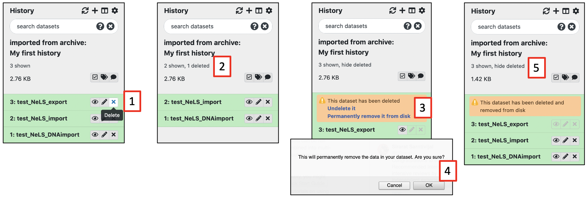
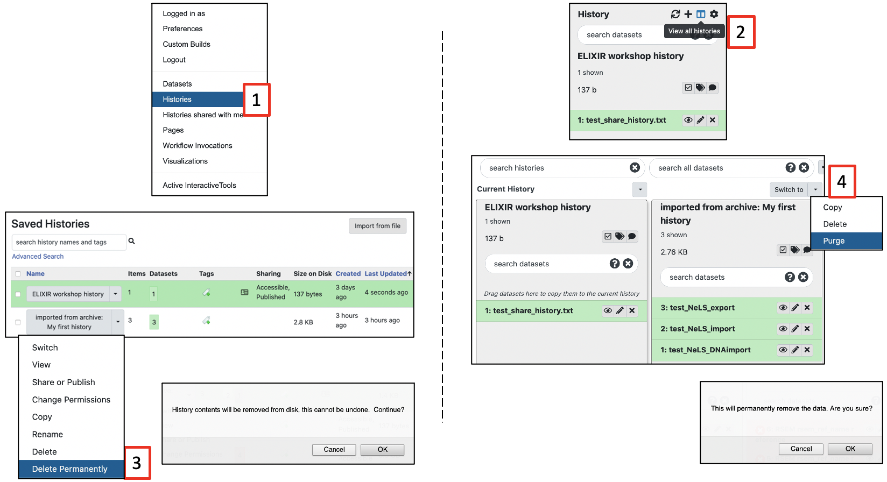

# Delete and permanent delete data in usegalaxy.no

Galaxy offer multiple ways to delete datasets and histories, and you will try two of them in this exercise. The are two major types of deletion:

1. Delete datasets or histories - This option temporary delete data (basically just hide the data)
2. Permanently delete datasets or histories - This option permanently delete data from the disk

!!! note

     We strongly encourage that you copy your histories to NeLS and permanently delete data from usegalaxy.no when you are done with your data analysis. This will free up your personal disk space in usegalaxy.no. To backup data to NeLS see [this documentation](usegalaxy_ImportExport.md)

## Delete datasets

Select the dataset(s) you want to delete (temporary) by pressing "**X**" next to the dataset in your "**History**" panel [1]. The dataset should disappear from you history, but you still access it [2]

You have only temporary deleted the data (equal to moving it to the trash bin on you computer), and it can be undeleted (moved back from trash bin), or permanently deleted by pressing "**Permanently remove it from disk**" [3]
Press "**OK**" to confirm the permanent deletion [4]

You can still see traces of the dataset in your history [5], but the data in the file is deleted from the disk and you have freed up disk space

## Delete complete histories
Similarly, you can temporary and permanently delete histories. Access the overview of your histories either by selecting "**Histories**" [1] under the **User**" menu or by pressing "**View all histories**" [2] in the "**History**" panel

From the drop-down menu of the history you want to delete (exemplified by the history named "**imported from archive: ....**""), press "**Delete Permanently**" [3] for permanent deletion. 

If you chose the other history view, from the drop-down menu of the history you want to delete press "**Purge**" [4]. Both options will ask you to confirm the deletion, and both options will erase the data from disk.

