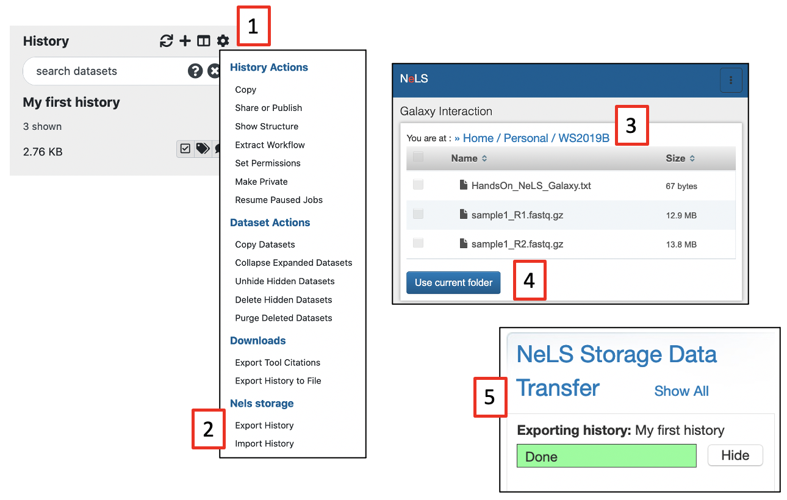

# Export and import Galaxy histories to and from NeLS

[usegalaxy.no](https://usegalaxy.no/) is directly connected to your data storage in [NeLS](https://nels.bioinfo.no/). This exclude the need for local copy of your data. You can simply transfer data directly between [usegalaxy.no](https://usegalaxy.no/) and [NeLS](https://nels.bioinfo.no/).

We have made a function in the [usegalaxy.no](https://usegalaxy.no/) that can export a whole history including the data sets in that history as a single compressed file to [NeLS](https://nels.bioinfo.no/). 

This file can be imported into another Galaxy instance and the analysis work can continue there. The advantage of this export is that all provenance data will be kept, meaning all commands, tool versions, database versions, etc that were used prior to the export.

!!! note

     Since usegalaxy.no is not meant for storage we encourage you to move your data when your analysis is done.

#### Before getting started

* Login to [https://usegalaxy.no/](https://usegalaxy.no/) - See how to login to usegalaxy.no [make a separate tutorial and link here]
* You need at least one history in usegalaxy.no to export

#### Exporting a history from usegalaxy.no to NeLS
Dataset and histories can also be exported from usegalaxy.no to your local system. 

!!! note

     💡If you have several histories, you would need to repeat the steps below for each history you would like to export.

* Make sure that the history you want to export is your current (active) history 
* Press the "**History options**" [1] and select "**Export History**" under the "**NeLS storage**" section [2]
* You will be redirected to the NeLS portal where you need to choose the destination folder [3] (shown here a random subfolder in the Personal folder)
* Browse to the folder you want to export the history to and press "**Use current folder**" [4].
* You should be redirected back to usegalaxy.no where you can view the transfer progress (you might need to scroll down a bit in the usegalaxy.no main window). When the transfer is complete, the progression bar will turn green [5]

#### Importing a history from NeLS to usegalaxy.no
Both single datasets and complete histories can be imported from your NeLS storage

!!! note

    💡When importing data from NeLS, you cannot define the datatype (format). You can change datatype once the datasets are imported into usegalaxy.no

* Press the "**History options**" and select "**Import History**" under the "**NeLS storage**" section [1]
* You will be redirected to the NeLS storage. browse to the folder containing the data (example here is a random subfolder in the Project folder), select the history (or file) [2] and press "**Send to Galaxy**" [3]
*You will be redirected back to usegalaxy.no and you can monitor the progress of the import [4]. The progress bar will turn green when the import is complete [5]
* The name of the imported history will be "**imported from archive: ....**"" The history can be accessed by selecting "**Histories**" [6] under the **User**" menu. You can rename the history if you like.

