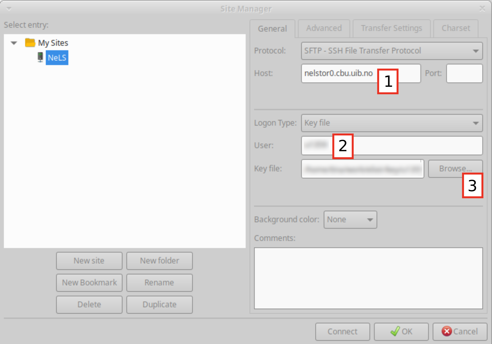
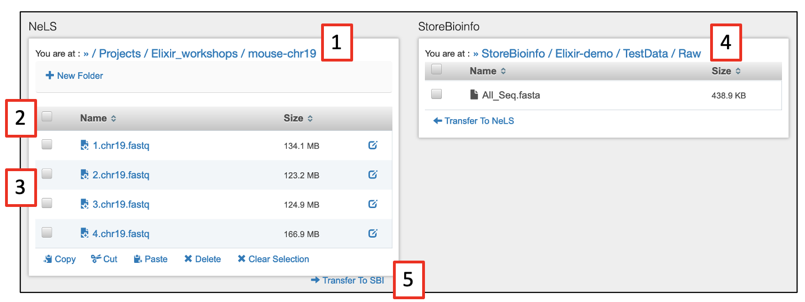
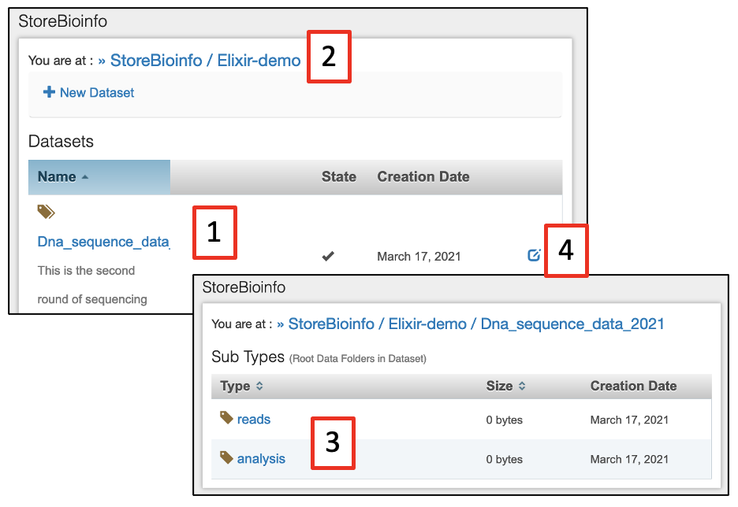
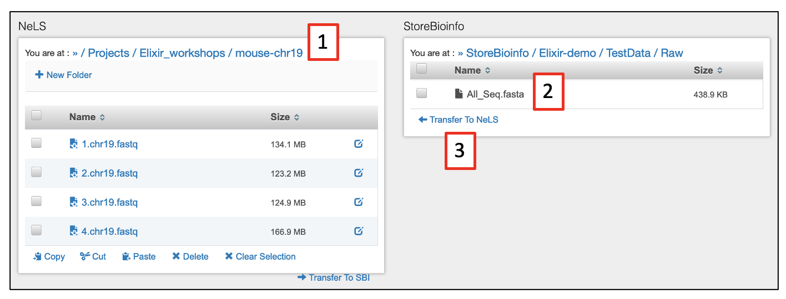

# User Documentation


!!! warning

	This page is still under construction


## Accessing NeLS
There are two ways you can access data on NeLS:

* Via the [NeLS portal](https://nels.bioinfo.no/) online GUI
* Using `ssh` through command line

### Via the NeLS portal
For quick browsing and simple file access you can log into [NeLS](https://nels.bioinfo.no/) using either their FEIDE identity if you are a member of a Norewegian institution or a NeLS identity which can be requested by contacting the ELIXIR support desk (See [I don't have FEIDE login credentials](about.html#i-dont-have-feide-login-credentials)).

!!! info

     This access option is used when data needs to be backed up from NeLS in SBI

### Using `ssh` through command Line

!!! info

     In order to access NeLS through a command line, you need to collect some connection details from the NeLS portal. See [this](user-doc.html#collect-connection-details-from-the-nels-portal) section for how to download a private SSH key.

After gathering your username and SSH key, you can use `ssh` to access NeLS with the following command:

```
ssh -i <SSH_key> <username>@nelstor0.cbu.uib.no
```

Absolute path to the home directory is `/elixir-chr/nels/users/<username>`.

## Collect connection details from the NeLS portal 

Access to NeLS using `ssh`, `scp`, or `sftp` (be it via command line or with programs like PuTTY and FileZilla) requires three specific pieces of information: host address [1], username [2] - it differs from FEiDE ID and Idp, and SSH private key associated with the username [3]. All the informations can be found in the Connection Details window of the NeLS portal. To open the window, navigate to the top right corner and select Connection Details form the menu. Screenshots of the menu and the window with highlighted connection details are shown below.

<p align="middle">

</p>

Download the SSH key to the computer from which you want to authenticate on NeLS, note the host address (`nelstor0.cbu.uib.no`) and your username. Modify access permissions for the SSH key in such a way that only you can read and write to the file and no other user can access the file. In the linux-based operating systems (including OsX), one can achieve this by typing `chmod 600 <SSH_key>` into a terminal window. In Windows, one can access the security tab in the `Properties` option of the `<SSH_key>` file and keep access granted only to oneself, `SYSTEM` and `Administrators`. 


## Transfer data to and from NeLS

### Upload/Download data using the Web interface of the NeLS portal

For quick browsing and simple file access a user can log into NeLS at https://nels.bioinfo.no/ using either their FEiDE identity if they are a member of a Norewegian institution or a NeLS identity which can be created by members of the Elixir Helpdesk with access to the NelS admin tools.

This access option is used when data needs to be backed up from NeLS to SBI, for details see section [Midterm data storage in NeLS and SBI](user-doc.html#midterm-data-storage-in-nels-and-sbi).

Here is a screenshot of the Personal Area in the NeLS portal. The numbered blocks highlight the following features: [1] Upload File(s), Add New Folder; [2] File and folder manipulation; [3] Rename file or folder; [4] (De)select all/some items; [5] Projects Area - the same functionality available there as in the Personal Area.

<p align="middle">

</p>

### Upload/Download using dedicated programs (FileZilla setup)

Programs such as [FileZilla](https://filezilla-project.org/) and [WinSCP](https://winscp.net/eng/download.php) can be used to transfer data to and from NeLS. Connection to NeLS has to be properly set up inside the tool’s configuration options providing the host address, username, and the user's SSH key. 

When using FileZilla, select `File` from the top menu and open `Site Manager...`. Click on the `New Site` button and call the new site `NeLS`.

Perform the following changes to the form:
   1. Change `Protocol` to `SFTP - SSH File Transfer Protocol`.
   2. Fill in `Host` from the NeLS Connection Details.
   3. Change `Logon Type` to `Key File`.
   4. Fill in `Username` from the NeLS Connection Details.
   5. Browse for the Key File, allow all file types to show in the pop-up window and select the SSH Key File downloaded from the NeLS portal.

The Site Manager Form will at the end look similar to the screenshot below with [1], [2], and [3] highlighting the filled in connection details. Press the `Connect` button. When the connection to NeLS is successfully established, the content of the local computer is shown in the left-hand side window and the content of NeLS is shown in the right-hand side window. File copying can be done by dragging and dropping files which should be coppied. When connecting to NeLS via FileZilla next time, hover with your cursor over the left-most icon (servers) below the top menu and select `NeLS` connection when it shows up.

<p align="middle">

</p>


### Upload/Download via the command line using `scp`

Here is a list of several examples of how to upload files and folders to NeLS using `scp` command as well as how to download them. In the examples,`\` at the end of the lines indicate command split accross multiple lines and can be omitted. Characters `$` and `>` at the beginning of the lines do not belong to the commands, they only mimic most likely response of a terminal window to the command splitting with `\` . To be able to follow this section, one needs to gather the connection details specified in the section "Collect the necessary connection details from the NeLS portal".


1. Upload a file into the `Personal` folder:
	```
	$ scp -i <SSH_key> \
	>  <file> \
	>  <username>@nelstor0.cbu.uib.no:/elixir-chr/nels/users/<username>/Personal
	```

2. Upload a file into a project folder:
	```
	$ scp -i <SSH_key> \
	> <file> \
	> <username>@nelstor0.cbu.uib.no:/elixir-chr/nels/users/<username>/Projects/<project>
	```

3. Upload a folder (recursive upload, `-r` option):
	```
	$ scp -r -i <SSH_key> \
	> <folder> \
	> <username>@nelstor0.cbu.uib.no:/elixir-chr/nels/users/<username>/Personal
	```

4. Download a file from the `Personal` folder:
	```
	$ scp -i <SSH_key> \
	> <username>@nelstor0.cbu.uib.no:/elixir-chr/nels/users/<username>/Personal/<file> \
	> <destination_local>
	```

5. Download all files with extension `.txt` from the `Personal` folder (wildcard usage):
	```
	$ scp -i <SSH_key> \
	> <username>@nelstor0.cbu.uib.no:/elixir-chr/nels/users/<username>/Personal/*.txt \
	> <destination_local>
	```

6. Download a folder from a project folder (recursive download, `-r` option):
	```
	$ scp -r -i <SSH_key> \
	> <username>@nelstor0.cbu.uib.no:/elixir-chr/nels/users/<username>/Projects/<project>/<folder> \
	> <destination_local>
	```
	
## Transfer data to and from SBI
SBI is only connected to NeLS. Data has to reside in NeLS before it can be imported in SBI, and data in SBI can only be exported to NeLS. You need to be member of a SBI project before you can transfer data between NeLS and SBI 

!!! note

	The only way to transfer data between NeLS and SBI is through the NeLS Portal web GUI. Data

#### Importing data in SBI
You will find all SBI projects you are a member of under the `StoreBioInfo` menu in the [NeLS Portal](https://nels.bioinfo.no/). You will see both your NeLS projects [1] (Personal and Projects) to the left of the screen and the SBI projects to the right [2].

Select the SBI project you would like to import data in. There might already exist datasets in the project [3], or you can [create a new dataset](user-doc.html#create-new-dataset-in-sbi) for new datasets.

Select the dataset you want to import data into [4] and the subfolder for the data [5]. The subfolder structure is automatically generated when a new dataset is created, and normally contain a folder named `rawdata` for the data from the data provider (e.g. fastq files prior to analysis) and a folder named `analysis` for the analysed data (e.g. assemblies and alignment files).

<p align="middle">

</p align="middle">

On the NeLS side, browser to the project and folders or files that you want to transfer to SBI [1]. Select single files [2] or all files [3]. Make sure you are in the correct destination folder on the SBI side [4], and press `Transfer to SBI` [5].

!!! note

	If you have a large number of files to transfer, you can transfer the whole directory containing the files in NeLS to SBI

<p align="middle">

</p align="middle">

#### Create new dataset in SBI
Within an existing project [1] you can create a new dataset by pressing `+ New Dataset` [2]. In the window that appear, select the `Dataset type` form the drop-down menu [3]. You also need to give the dataset a `Name` [5] and a short `Description` [5]. Finally, press `Create` [6] to make the new dataset folder in SBI.

<p align="middle">

</p align="middle">

!!! note

	If you have a large number of files to transfer, you can transfer the whole directory containing the files in NeLS to SBI

The new dataset should appear on the list of datasets [1] in the project you created it in [2]. This should also have created subfolders for raw data and analysed data [3]. It is possible to edit the `Name` and `Description` of the dataset [4].

<p align="middle">

</p align="middle">

#### Exporting data from SBI
Exporting data from SBI to NeLS is similar to importing files to SBI from NeLS. Make sure you are in the correct destination folder on the NeLS side [1]. On the SBI side, browser to the project and folders or files that you want to transfer to SBI [2], and press `Transfer to NeLS` [3].

<p align="middle">

</p align="middle">

## Midterm data storage in NeLS and SBI
NeLS is meant for storing and sharing active project data. This is typically data that are being analysed and shared with collaborators during a project. Data normally reside here for months/years.

SBI is meant for more long term storage of project data. This is typically data that are not being analysed at the moment, but is planned to included later in the project. Data normally reside here for years

## Where to deposit data long term
When a project is ready for publication, the data should be deposited in public data repositories (deposition databases or data archives) suitable for the type of data. A project can hold different types of data that should be submitted to different data repositories.

ELIXIR Norway is a data broker for the [European Nucleotide Archive](https://www.ebi.ac.uk/ena/browser/home) (ENA) and support Norwegian users to submit sequence data there.

!!! note

	If you need support in finding the proper end point for your data, please contact the ELIXIR Norway support desk by sending an email to [contact@bioinfo.no](mailto:contact@bioinfo.no)

## Import and export Galaxy histories to and from NeLS
[usegalaxy.no](https://usegalaxy.no/) is directly connected to your data storage in [NeLS](https://nels.bioinfo.no/). We have made a function in the [usegalaxy.no](https://usegalaxy.no/) that can export a whole history including the data sets in that history as a single compressed file to [NeLS](https://nels.bioinfo.no/). 

This file can be imported into another Galaxy instance and the analysis work can continue there. The advantage of this export is that all provenance data will be kept, meaning all commands, tool versions, database versions, etc that were used prior to the export.

!!! note

     Since usegalaxy.no is not meant for storage we encourage you to move your data when your analysis is done.

#### Before getting started

* Login to [https://usegalaxy.no/](https://usegalaxy.no/) with your FEIDE or NeLS idp
* You need at least one history in usegalaxy.no to export

#### Exporting a history from usegalaxy.no to NeLS
Dataset and histories can also be exported from usegalaxy.no to your local system. 

!!! note

     💡If you have several histories, you would need to repeat the steps below for each history you would like to export.

* Make sure that the history you want to export is your current (active) history 
* Press the `History options` [1] and select `Export History` under the `NeLS storage` section [2]
* You will be redirected to the NeLS portal where you need to choose the destination folder [3] (shown here a random subfolder in the Personal folder)
* Browse to the folder you want to export the history to and press `Use current folder` [4].
* You should be redirected back to usegalaxy.no where you can view the transfer progress (you might need to scroll down a bit in the usegalaxy.no main window). When the transfer is complete, the progression bar will turn green [5]


#### Importing a history from NeLS to usegalaxy.no
Both single datasets and complete histories can be imported from your NeLS storage

!!! note

    💡When importing data from NeLS, you cannot define the datatype (format). You can change datatype once the datasets are imported into usegalaxy.no

* Press the `History options` and select `Import History` under the `NeLS storage` section [1]
* You will be redirected to the NeLS storage. browse to the folder containing the data (example here is a random subfolder in the Project folder), select the history (or file) [2] and press `Send to Galaxy` [3]
*You will be redirected back to usegalaxy.no and you can monitor the progress of the import [4]. The progress bar will turn green when the import is complete [5]
* The name of the imported history will be `imported from archive: ....` The history can be accessed by selecting `Histories` [6] under the `User` menu. You can rename the history if you like.


## Delete and permanent delete data in usegalaxy.no
Galaxy offer multiple ways to delete datasets and histories. The are two major types of deletion:

1. Delete datasets or histories - This option temporary delete data (basically just hide the data)
2. Permanently delete datasets or histories - This option permanently delete data from the disk

!!! note

     We strongly encourage that you copy your histories to NeLS and permanently delete data from usegalaxy.no when you are done with your data analysis. This will free up your personal disk space in usegalaxy.no. To backup data to NeLS see [this documentation](user-doc.html#exporting-a-history-from-usegalaxyno-to-nels)

### Delete datasets
Select the dataset(s) you want to delete (temporary) by pressing `X` next to the dataset in your `History` panel [1]. The dataset should disappear from you history, but you still access it [2]

You have only temporary deleted the data (equal to moving it to the trash bin on you computer), and it can be undeleted (moved back from trash bin), or permanently deleted by pressing `Permanently remove it from disk` [3]
Press `OK` to confirm the permanent deletion [4]

You can still see traces of the dataset in your history [5], but the data in the file is deleted from the disk and you have freed up disk space


### Delete complete histories
Similarly, you can temporary and permanently delete histories. Access the overview of your histories either by selecting `Histories` [1] under the `User` menu or by pressing `View all histories` [2] in the `History` panel

From the drop-down menu of the history you want to delete (exemplified by the history named `imported from archive: ....`), press `Delete Permanently` [3] for permanent deletion. 

If you chose the other history view, from the drop-down menu of the history you want to delete press `Purge` [4]. Both options will ask you to confirm the deletion, and both options will erase the data from disk.


## Import and export workflows in usegalaxy.no
Galaxy offers a simple way to download a workflow as a single file which can be imported into another Galaxy instance and run there. 

!!! note

     Different Galaxy instances may have different versions of the same tool installed. This may cause the Galaxy instance you import the workflow into to throw a warning. In order for the imported and exported workflows to give identical results, the tool versions must be identical 

	There might be individual tool parameter settings that are pre-set in the exported workflow that for some reason are not carried over properly during the import. In order for the imported and exported workflows to give identical results, the individual tool parameter settings must be identical 

	A tool may not be installed in the Galaxy instance you are importing the workflow. In order for the workflow to run, the tool must be installed 

	A tool may be dependent on a pre-indexed reference. In order for the workflow to run, the reference must be available 

### Exporting a workflow:
Select the `Workflow` menu [1]

A list of the workflows you have created or imported into your user in usegalaxy.no will be displayed

From the menu that appear by clicking on the name of the workflow you want to export [2], select `Download` [3] and save the workflow (single .ga file) to your local machine


### Importing a workflow
Select the `Workflow` menu [1]

A list of workflows that you have created or imported (if you have any) will be displayed

Pressing `Import` [2] and a pop-up window with import options will appear. If you have the workflow stored locally, press `Browse` [3] and select the .ga file and press `Import workflow` [4]

!!! note

     Is is possible to import publicly available workflows directly via the URL

The imported workflow will appear in the list of workflows


Different tool versions on exporting and importing Galaxy servers may cause the workflow to throw a warning. Click on the name of the workflow and select the `Edit` [1] to view potential issues, then press `Continue` [2]

You should now be able to run the workflow


