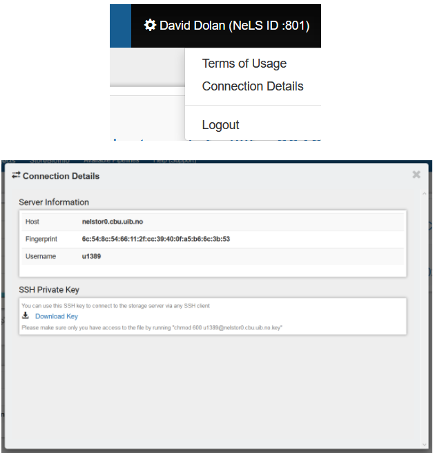

# User Documentation

!!! warning

	This page is still under construction

## Accessing NeLS
There is three ways you can access data on NeLS:

* Via the [NeLS portal](https://nels.bioinfo.no/) online GUI
* Through a command line
* SFTP software (e.g. [FileZilla](https://filezilla-project.org/))

!!! info

     In order to access NeLS through a terminal or SFTP software, you need to download a private SSH key. See [this](user-doc.html#download-private-ssh-key) section for how to download a private SSH key

#### Via the NeLS portal
For quick browsing and simple file access you can log into [NeLS](https://nels.bioinfo.no/) using either their FEIDE identity if you are a member of a Norewegian institution or a NeLS identity which can be requested by contacting the ELIXIR support desk (See [I don't have FEIDE login credentials](./about.html#i-dont-have-feide-login-credentials)).

!!! info

     This access option is used when data needs to be backed up from NeLS in SBI

#### Command Line
If the operating system you are using has a unix/linux based terminal then the NeLS server can be accessed via ssh and scp command depending on what is needed.

Mac OS and Linux operative systems come with terminal access by default and Windows users can download an app such as Ubuntu for Windows via the Microsoft Store to install a linux terminal.

#### SFTP Software
Programs such as [FileZilla](https://filezilla-project.org/) and [WinSCP](https://winscp.net/eng/download.php) can also be used to access data in NeLS.

Due to needing the SSH key quick connect methods in these tools can not be used. Instead connections have to be properly set up inside the tools’ configurations options such as Filezilla’s Site Manager. Go [here](./user-doc.html#transfer-data-to-and-from-nels) for a detailed description on how to set up the Filezilla connection to NeLS. 

!!! info

     Please note that when using a SSH key, permissions can become important. It may become necessary to edit the permissions of the downloaded key file and the easiest way to do this is via a command using a chmod command.

## Download private SSH key

To access to NeLS via the command line or through SFTP Software requires a SSH private key. This key is available from inside the NeLS webportal. In order to download the key, you must first log in to the [NeLS portal](https://nels.bioinfo.no/).

The key as well as a user’s user name which is not the same as their FEIDE ID can be found in the `Connection Details` tab accessible from the top right of the NeLS portal page, under your user name.

Download your private SSH key by pressing `Download Key`. Save the file on your local computer.

Before you can start using this key, you need change the file mode of key. For Windows users we recommend that you install [Git for Windows](https://git-scm.com/download/win) first. A detailed description of how to install Git for Windows can be found in the [carpentries repository](https://carpentries.github.io/workshop-template/#shell) in GitHub

In a terminal window type (replace <user> with your NeLS username - see image above):

    chmod 600 <user>@nelstor0.cbu.uib.no.key

The key is now ready for use via the command line or through SFTP Software.

## Transfer data to and from NeLS

!!! warning

	This part of the page is still under construction

Joshua and Tina

### Upload/Download data using the Web interface
For quick browsing and simple file access a user can log into NeLS at https://nels.bioinfo.no/ using either their FEiDE identity if they are a member of a Norewegian institution or a NeLS identity which can be created by members of the Elixir Helpdesk with access to the NelS admin tools.

This access option is used when data needs to be backed up from NeLS in SBI

### Upload/Download using SFTP tools
Programs such as Filezilla and WinSCP can also be used to access data stored up on NeLS. Connections have to be properly set up inside the tools’ configurations options such as Filezilla’s Site Manager. As these methods require the SSH key, quick connect methods in these tools can not be used to establish a connection.

### Upload/Download via the command line
If the operating system you are using has a unix/linux based terminal then the NeLS server can be accessed via ssh and scp command depending on what is needed.

Mac OS and Linux operating systems come with terminal access by default and Windows users can download an app such as Ubuntu for WIndows via the Microsoft Store to install a linux terminal.

Access to NeLS via this method requires a SSH private key available from inside the NeLS webportal.

The key as well as a user’s user name which is not the same as their FEiDE ID can be found in the Connection Details tab accessible from the top right of the NeLS webportal pages as shown below.

	The host address, nelstor0.cbu.uib.no, is common for all users.

## Midterm data storage in NeLS and SBI
NeLS is meant for storing and sharing active project data. This is typically data that are being analysed and shared with collaborators during a project. Data normally reside here for months/years.

SBI is meant for more long term storage of project data. This is typically data that are not being analysed at the moment, but is planned to included later in the project. Data normally reside here for years

## Where to deposit data long term
When a project is ready for publication, the data should be deposited in public data repositories (deposition databases or data archives) suitable for the type of data. A project can hold different types of data that should be submitted to different data repositories.

ELIXIR Norway is a data broker for the [European Nucleotide Archive](https://www.ebi.ac.uk/ena/browser/home) (ENA) and support Norwegian users to submit sequence data there.

!!! note

	If you need support in finding the proper end point for your data, please contact the ELIXIR Norway support desk by sending an email to [contact@bioinfo.no](mailto:contact@bioinfo.no)

## Import and export Galaxy histories to and from NeLS
[usegalaxy.no](https://usegalaxy.no/) is directly connected to your data storage in [NeLS](https://nels.bioinfo.no/). We have made a function in the [usegalaxy.no](https://usegalaxy.no/) that can export a whole history including the data sets in that history as a single compressed file to [NeLS](https://nels.bioinfo.no/). 

This file can be imported into another Galaxy instance and the analysis work can continue there. The advantage of this export is that all provenance data will be kept, meaning all commands, tool versions, database versions, etc that were used prior to the export.

!!! note

     Since usegalaxy.no is not meant for storage we encourage you to move your data when your analysis is done.

#### Before getting started

* Login to [https://usegalaxy.no/](https://usegalaxy.no/) with your FEIDE or NeLS idp
* You need at least one history in usegalaxy.no to export

#### Exporting a history from usegalaxy.no to NeLS
Dataset and histories can also be exported from usegalaxy.no to your local system. 

!!! note

     💡If you have several histories, you would need to repeat the steps below for each history you would like to export.

* Make sure that the history you want to export is your current (active) history 
* Press the "**History options**" [1] and select "**Export History**" under the "**NeLS storage**" section [2]
* You will be redirected to the NeLS portal where you need to choose the destination folder [3] (shown here a random subfolder in the Personal folder)
* Browse to the folder you want to export the history to and press "**Use current folder**" [4].
* You should be redirected back to usegalaxy.no where you can view the transfer progress (you might need to scroll down a bit in the usegalaxy.no main window). When the transfer is complete, the progression bar will turn green [5]

#### Importing a history from NeLS to usegalaxy.no
Both single datasets and complete histories can be imported from your NeLS storage

!!! note

    💡When importing data from NeLS, you cannot define the datatype (format). You can change datatype once the datasets are imported into usegalaxy.no

* Press the "**History options**" and select "**Import History**" under the "**NeLS storage**" section [1]
* You will be redirected to the NeLS storage. browse to the folder containing the data (example here is a random subfolder in the Project folder), select the history (or file) [2] and press "**Send to Galaxy**" [3]
*You will be redirected back to usegalaxy.no and you can monitor the progress of the import [4]. The progress bar will turn green when the import is complete [5]
* The name of the imported history will be "**imported from archive: ....**"" The history can be accessed by selecting "**Histories**" [6] under the **User**" menu. You can rename the history if you like.

## Delete and permanent delete data in usegalaxy.no
Galaxy offer multiple ways to delete datasets and histories. The are two major types of deletion:

1. Delete datasets or histories - This option temporary delete data (basically just hide the data)
2. Permanently delete datasets or histories - This option permanently delete data from the disk

!!! note

     We strongly encourage that you copy your histories to NeLS and permanently delete data from usegalaxy.no when you are done with your data analysis. This will free up your personal disk space in usegalaxy.no. To backup data to NeLS see [this documentation](usegalaxy_ImportExport.md)

### Delete datasets
Select the dataset(s) you want to delete (temporary) by pressing "**X**" next to the dataset in your "**History**" panel [1]. The dataset should disappear from you history, but you still access it [2]

You have only temporary deleted the data (equal to moving it to the trash bin on you computer), and it can be undeleted (moved back from trash bin), or permanently deleted by pressing "**Permanently remove it from disk**" [3]
Press "**OK**" to confirm the permanent deletion [4]

You can still see traces of the dataset in your history [5], but the data in the file is deleted from the disk and you have freed up disk space

### Delete complete histories
Similarly, you can temporary and permanently delete histories. Access the overview of your histories either by selecting "**Histories**" [1] under the **User**" menu or by pressing "**View all histories**" [2] in the "**History**" panel

From the drop-down menu of the history you want to delete (exemplified by the history named "**imported from archive: ....**""), press "**Delete Permanently**" [3] for permanent deletion. 

If you chose the other history view, from the drop-down menu of the history you want to delete press "**Purge**" [4]. Both options will ask you to confirm the deletion, and both options will erase the data from disk.

## Import and export workflows in usegalaxy.no
Galaxy offers a simple way to download a workflow as a single file which can be imported into another Galaxy instance and run there. 

!!! note

     Different Galaxy instances may have different versions of the same tool installed. This may cause the Galaxy instance you import the workflow into to throw a warning. In order for the imported and exported workflows to give identical results, the tool versions must be identical 

	There might be individual tool parameter settings that are pre-set in the exported workflow that for some reason are not carried over properly during the import. In order for the imported and exported workflows to give identical results, the individual tool parameter settings must be identical 

	A tool may not be installed in the Galaxy instance you are importing the workflow. In order for the workflow to run, the tool must be installed 

	A tool may be dependent on a pre-indexed reference. In order for the workflow to run, the reference must be available 

### Exporting a workflow:
Select the **"Workflow"** menu [1]

A list of the workflows you have created or imported into your user in usegalaxy.no will be displayed

From the menu that appear by clicking on the name of the workflow you want to export [2], select **"Download"** [3] and save the workflow (single .ga file) to your local machine

### Importing a workflow
Select the **"Workflow"** menu [1]

A list of workflows that you have created or imported (if you have any) will be displayed

Pressing **"Import"** [2] and a pop-up window with import options will appear. If you have the workflow stored locally, press **"Browse"** [3] and select the .ga file and press **"Import workflow"** [4]

!!! note

     Is is possible to import publicly available workflows directly via the URL

The imported workflow will appear in the list of workflows

Different tool versions on exporting and importing Galaxy servers may cause the workflow to throw a warning. Click on the name of the workflow and select the **"Edit"** [1] to view potential issues, then press **"Continue"** [2]

You should now be able to run the workflow

